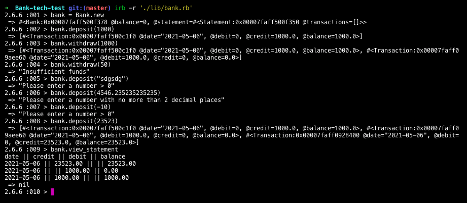

# Bank tech test

This is the second version of my completed Bank Tech Test in Ruby. It stores a balance and allows the user to withdraw and deposit funds. It prints a statement listing transactions.

Simplecov reports 100% test coverage.



## Dependencies

* Rspec (testing)
* Simplecov (test coverage)
* Simplecov-console (test coverage)
* Rubocop (linting)
* Rubocop-rspec (linting)
* Relaxed-Rubocop (linting rules)

## Installation

* Clone this Repo
* cd to the project directory
* Bundle install

## Running tests

* cd to the project directory
* rspec to run tests

## Usage

irb -r './lib/texttest_fixture.rb'

```ruby
bank = Bank.new
bank.deposit(200) # Adds 200 to the balance
bank.withdraw(100) # Adds 100 to the balance
bank.view_statement # Would return a statement in the following format: "date || credit || debit || balance\n2021-05-05 || || 100.00 || 100.00\n2021-05-05 || 200.00 || || 200.00"
bank.balance # Would return 100
```

## About this project

I began this project by creating the 'bank' class. This seemed like the obvious home for withdrawals and deposits, and the place in which the balance could be managed. It seemed clear to me that statements would not be generated here, and therefore that transactions would also be stored elsewhere. I felt that this would prevent tampering, as users have to withdraw and deposit money, but this should be the only way to manipulate the balance. As such, there are no private methods, because I didn't feel that at this stage there needed to be. The bank class's 'view_statement' method calls a method within the statement class. It keeps this code hidden from the user, but means that it is still easily-accessible. 'deposit' and 'withdraw 'methods in the bank class share a method to check that the input is valid, helping to keep the code DRY.

Transactions are stored at the time that withdrawals and deposits are made. I originally had a method to return the balance to the user at the end of each transaction, but removed this as I felt that it was not a specified part of the program. Moreover, as the transaction is returned (implicitly), the user is able to see their balance by reading this. I do, however, feel that it would be more user-friendly if only the balance was displayed.

I wanted each transaction to be an object. This makes transactions easy to manipulate and means that it is simple to determine what each attribute is. As the only current use for transactions is to display them afterwards, they are stored in an array. I originally included a 'time' attribute for each transaction, but ultimately decided that this was not necessary because transactions are already added to the array in the order that they are created. This facilitates displaying transactions in chronological order. I feel that ultimately it would be more elegant to have a 'time' attribute, which could also be displayed on a statement, in addition to where the transaction was carried out.

The statement class has the responsibility of printing a statement. As such, it also handles things such as formatting the currency appropriately. To extend this further, the currency type (e.g. GBP, EUR) could be displayed. I made the decision to reject transactions that had more than 2 decimal places. This is done in the bank class. However, I believe that in some industries transactions such as these are carried out, but rounded (e.g. currency conversion, stocks and share sales). It might be that a future iteration of the program could perform this rounding, rather than rejecting numbers with a greater number of decimal places.

## A note about Linting

Rubocop threw errors about the way currency was formatted. However, the syntax it favoured was not a widely-used way of doing things. For this reason, the 'relaxed-rubocop' gem has been included. Furthermore, Rubocop wanted the inclusion of the 'frozen_string_literals: true' at the top of files. However, this was opposed to the proper functioning of the program. As such, Rubocop is instructed to ignore this in the yml file.
